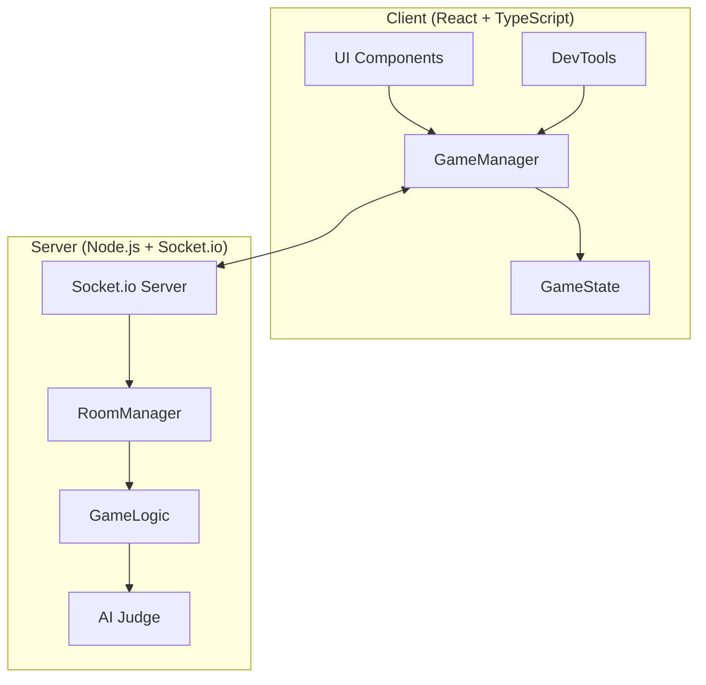
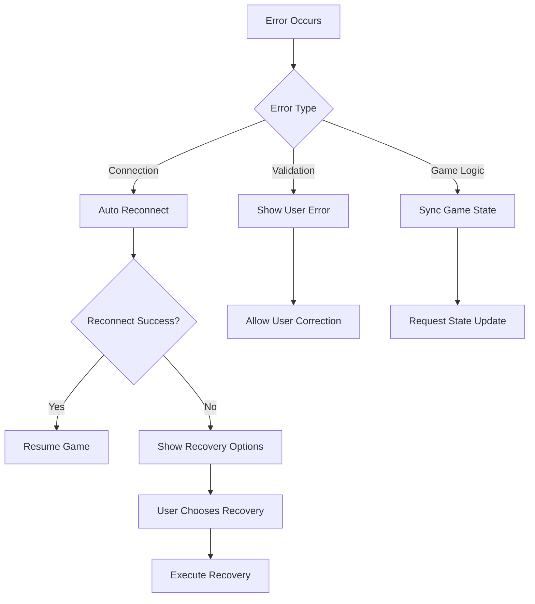

# Design Document

## Overview

This design unifies the Doodle game architecture by consolidating around the Socket.io-based implementation while removing P2P remnants and establishing a robust, testable foundation. The design maintains all existing functionality while providing clear separation of concerns, comprehensive error handling, and developer tools for testing and debugging.

## Architecture

### High-Level Architecture



### Networking Architecture Decision

**Decision: Standardize on Socket.io**

**Rationale:**
- Server-authoritative architecture prevents cheating and ensures consistency
- Better reliability than P2P (no NAT traversal issues)
- Easier to scale and deploy
- Better integration with AI judging system
- Existing Socket.io implementation is more complete

**Trade-offs:**
- Requires server infrastructure (vs P2P's serverless approach)
- Single point of failure (mitigated by proper error handling)
- Slightly higher latency (negligible for turn-based gameplay)

## Components and Interfaces

### 1. GameManager (Unified Interface)

The `GameManager` provides a clean, consistent API for all game operations, abstracting away networking details from UI components.

```typescript
interface GameManager {
  // Connection Management
  hostGame(playerName: string): Promise<string>;
  joinGame(playerName: string, roomCode: string): Promise<void>;
  disconnect(): void;
  
  // Game Actions
  startVoting(): void;
  voteForWord(word: string): void;
  submitDrawing(canvasData: string): void;
  
  // State Management
  getGameState(): GameState;
  onStateChange(callback: (state: GameState) => void): void;
  
  // Error Handling
  onError(callback: (error: GameError) => void): void;
  
  // Development Tools
  enableDevMode(): void;
  simulateGameState(state: Partial<GameState>): void;
}
```

### 2. GameState (Unified Data Model)

```typescript
interface GameState {
  // Connection Info
  roomCode: string;
  isConnected: boolean;
  connectionStatus: 'connecting' | 'connected' | 'disconnected' | 'error';
  
  // Player Management
  players: Player[];
  currentPlayer: Player;
  hostId: string;
  
  // Game Flow
  gamePhase: 'lobby' | 'voting' | 'drawing' | 'judging' | 'results';
  
  // Voting Data
  wordOptions: string[];
  votes: Record<string, number>;
  chosenWord: string;
  
  // Drawing Data
  timeRemaining: number;
  drawingTimeLimit: number;
  submittedDrawings: number;
  
  // Results Data
  results: GameResult[];
  
  // Error State
  lastError?: GameError;
}
```

### 3. NetworkManager (Internal Implementation)

```typescript
interface NetworkManager {
  connect(serverUrl: string): Promise<void>;
  disconnect(): void;
  send(event: string, data: any): void;
  on(event: string, handler: (data: any) => void): void;
  off(event: string, handler?: (data: any) => void): void;
  isConnected(): boolean;
}
```

### 4. DevTools Interface

```typescript
interface DevTools {
  // State Simulation
  simulateMultiplePlayers(count: number): void;
  simulateVotingTie(words: string[]): void;
  simulateNetworkError(): void;
  simulateDisconnection(): void;
  
  // Game Flow Testing
  skipToVoting(): void;
  skipToDrawing(word: string): void;
  skipToResults(mockResults: GameResult[]): void;
  
  // Debugging
  inspectGameState(): GameState;
  inspectNetworkMessages(): NetworkMessage[];
  exportGameSession(): string;
  
  // Automated Testing
  runGameFlowTest(): Promise<TestResult>;
  validateStateConsistency(): ValidationResult;
}
```

## Data Models

### Core Data Types

```typescript
interface Player {
  id: string;
  name: string;
  isHost: boolean;
  isConnected: boolean;
  hasVoted: boolean;
  hasSubmittedDrawing: boolean;
  score: number;
}

interface GameResult {
  playerId: string;
  playerName: string;
  rank: number;
  score: number;
  feedback: string;
  canvasData: string;
}

interface GameError {
  code: string;
  message: string;
  details?: any;
  timestamp: Date;
  recoverable: boolean;
}

interface NetworkMessage {
  type: string;
  data: any;
  timestamp: Date;
  direction: 'sent' | 'received';
}
```

### Message Types

```typescript
// Client to Server Messages
type ClientMessage = 
  | { type: 'create-room'; data: { playerName: string } }
  | { type: 'join-room'; data: { roomCode: string; playerName: string } }
  | { type: 'start-voting'; data: { roomCode: string } }
  | { type: 'vote-word'; data: { roomCode: string; word: string } }
  | { type: 'submit-drawing'; data: { roomCode: string; canvasData: string } }
  | { type: 'disconnect'; data: { roomCode: string } };

// Server to Client Messages  
type ServerMessage =
  | { type: 'room-created'; data: { roomCode: string; gameState: GameState } }
  | { type: 'room-joined'; data: { roomCode: string; gameState: GameState } }
  | { type: 'game-state-updated'; data: { gameState: GameState } }
  | { type: 'voting-started'; data: { gameState: GameState } }
  | { type: 'drawing-started'; data: { gameState: GameState } }
  | { type: 'results-ready'; data: { gameState: GameState } }
  | { type: 'error'; data: { error: GameError } };
```

## Error Handling

### Error Categories

1. **Connection Errors**
   - Server unreachable
   - Network timeout
   - Authentication failure

2. **Game Logic Errors**
   - Invalid room code
   - Room full
   - Invalid game state transition

3. **Validation Errors**
   - Invalid player name
   - Invalid drawing data
   - Rate limiting

### Error Recovery Strategies

```typescript
interface ErrorRecoveryStrategy {
  // Automatic Recovery
  autoReconnect(maxAttempts: number): Promise<boolean>;
  retryLastAction(): Promise<boolean>;
  
  // User-Guided Recovery
  showRecoveryOptions(error: GameError): RecoveryOption[];
  executeRecovery(option: RecoveryOption): Promise<boolean>;
  
  // Fallback Modes
  enableOfflineMode(): void;
  switchToLocalMode(): void;
}
```

### Error Handling Flow



## Testing Strategy

### Unit Testing

1. **GameManager Tests**
   - Mock network layer
   - Test all public methods
   - Verify state transitions
   - Test error scenarios

2. **Component Tests**
   - Mock GameManager
   - Test UI interactions
   - Verify prop handling
   - Test error display

### Integration Testing

1. **Network Integration**
   - Test with real Socket.io server
   - Verify message flow
   - Test connection scenarios
   - Test error conditions

2. **Game Flow Testing**
   - End-to-end game scenarios
   - Multi-player simulation
   - State synchronization
   - Error recovery

### Developer Tools Testing

1. **Simulation Tools**
   - Verify state simulation accuracy
   - Test multi-player scenarios
   - Validate error injection
   - Test automated flows

2. **Debugging Tools**
   - Verify state inspection
   - Test message logging
   - Validate export/import
   - Test consistency checks

### Testing Architecture

```typescript
interface TestingFramework {
  // Mock Services
  createMockGameManager(): MockGameManager;
  createMockNetworkManager(): MockNetworkManager;
  createMockServer(): MockServer;
  
  // Test Utilities
  simulateMultipleClients(count: number): TestClient[];
  runGameScenario(scenario: GameScenario): Promise<TestResult>;
  validateGameState(state: GameState): ValidationResult;
  
  // Automated Testing
  runRegressionTests(): Promise<TestSuite>;
  runPerformanceTests(): Promise<PerformanceReport>;
  runStressTests(): Promise<StressTestReport>;
}
```

## Implementation Strategy

### Phase 1: Core Unification
1. Remove P2PGameManager completely
2. Enhance SocketGameManager with unified interface
3. Update all components to use unified GameManager
4. Implement comprehensive error handling

### Phase 2: Developer Tools
1. Create DevTools component and service
2. Implement state simulation capabilities
3. Add debugging and inspection tools
4. Create automated testing utilities

### Phase 3: Testing & Validation
1. Implement comprehensive test suite
2. Add integration tests
3. Create performance benchmarks
4. Validate error recovery scenarios

### Phase 4: Documentation & Polish
1. Update all documentation
2. Add JSDoc comments
3. Create developer guides
4. Optimize performance

## Security Considerations

1. **Input Validation**
   - Sanitize all user inputs
   - Validate room codes and player names
   - Limit drawing data size

2. **Rate Limiting**
   - Limit connection attempts
   - Throttle message frequency
   - Prevent spam voting

3. **Data Protection**
   - Don't store sensitive data
   - Sanitize error messages
   - Implement proper CORS

## Performance Considerations

1. **Network Optimization**
   - Compress large messages
   - Batch state updates
   - Implement message queuing

2. **Memory Management**
   - Clean up disconnected players
   - Limit message history
   - Garbage collect old game states

3. **Scalability**
   - Design for horizontal scaling
   - Implement connection pooling
   - Optimize database queries (if added)

## Deployment Strategy

1. **Environment Configuration**
   - Separate dev/staging/prod configs
   - Environment variable management
   - Feature flags for new functionality

2. **Monitoring**
   - Connection health monitoring
   - Error rate tracking
   - Performance metrics

3. **Rollback Strategy**
   - Maintain backward compatibility
   - Implement feature toggles
   - Plan rollback procedures